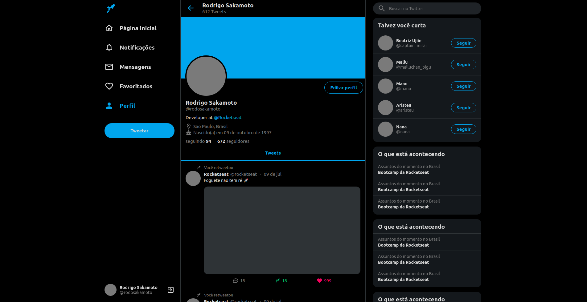

<h1 align="center" >
  Twiiter Clone
</h1>

<h3 align="center"> Um clone da interface do Twtitter feito com ReactJS</h3>


<p align="center">
  
</p>


<h3>Para visualizar o projeto <a href="https://clonetwitter.netlify.app/">Clique aqui</a>, ou, execute os comandos abaixo:</h3>

```bash
$ git clone https://github.com/rodrigosakamoto/twitter-clone.git

$ cd twitter-clone

# Em seguida execute:
$ yarn

$ yarn start
```
---
By [Rodrigo Sakamoto](https://www.linkedin.com/in/rodrigo-sakamoto/)
